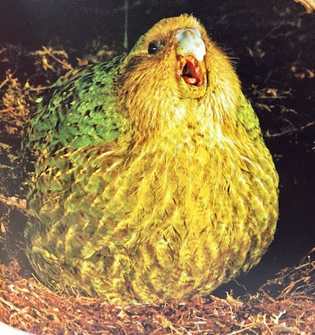

# McScraggins

An [Alexa](https://alexa.amazon.com/spa/index.html) skill requested by my daughter Zeyana.  
```
invocation: Alexa, what you got.

response: McScraggins, McScraggins, McScraggins, McScraggins, McScraggins, McScraggins.
```
Built using [jovo](https://github.com/jovotech/jovo-framework)



### environment

```bash
npm install -g jovo-cli
npm install -g ask-cli

ask init
```
### build & run local

```bash
npm run build-local
npm run local
```

### build & run lambda local, with alexa remote

```bash
npm run build-local
npm run deploy
npm run local
```


### build & deploy remote

```bash
npm run build
npm run deploy
```
